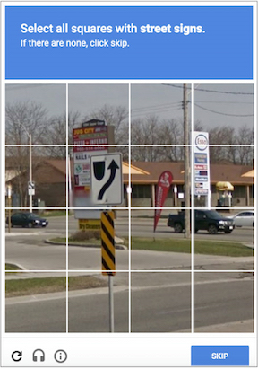
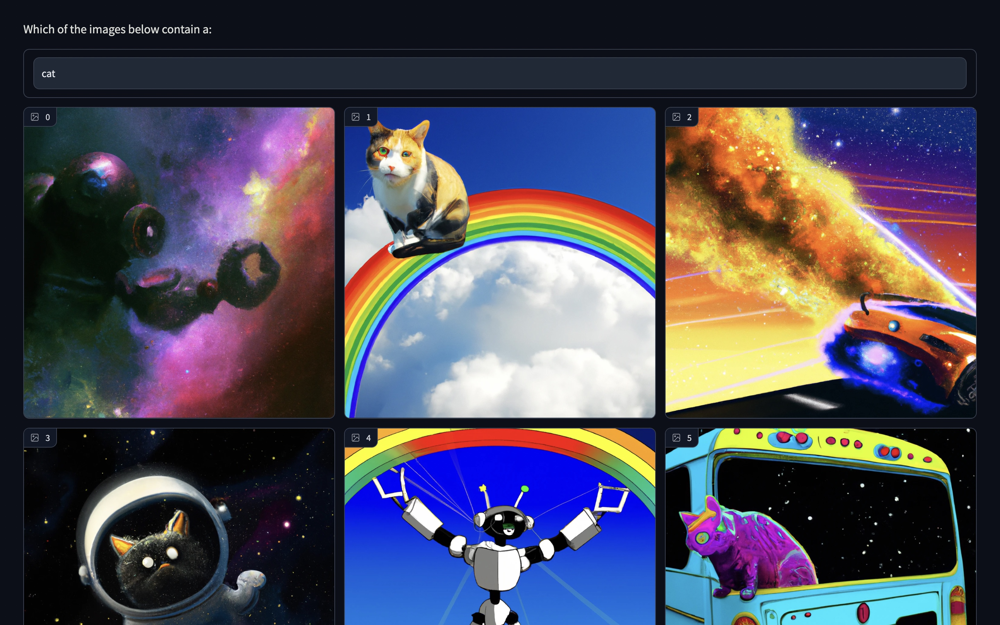

# OpenAI User Validation

Building a better funnel to validate whether a human is interacting with a website using OpenAI GPT-3 and DALL-E.

## Description

ReCAPTCHA is a common interaction on the internet but everyone has experienced frustration with tests that are undecipherable, acting as a mousetrap against robots that often catches users too. Additionally, these images are in sample and potentially vulnerable to the adversary they are designed to thwart.



There is a better way, with generative models like GPT-3 and DALL-E, where unique, beautiful, out of sample images offer a rich user experience and ease for humans but are almost impossible for a robot to solve. Instead of acting as a mousetrap, such a utility offers a better funnel, to get the intended user to the destination.




## Getting Started

**Note**
A demo video is available [here](multimedia/gradio_demo.mov)

### Dependencies

* [Gradio](https://www.gradio.app/getting_started/)
* Python 3.9.*

### Installing

* Clone this repo
* Configuration files:
    * keys.py:
        * gpt_key: gpt-3 secret key 
        * dalle_key: dall-e session token 
    * seed.py: contains seed terms for text and image generation
* Nothing needs to change if you are simply running the demo

### Executing program

* This repo contains two python scripts:    
    * `gradio_demo.py` runs a gradio app using a rotating set of pre-generated images. 3 pre-built bundles are included for your exploration
    * `openai_gen_data.py` generates seed phrases for GPT-3 to build prompts for DALL-E which are then used to return 4 images for each prompt, the results are pickled into the archive/ folder. The app above randomly loads one of these images for each prompt 

* Step-by-step bullets
    * Running the demo:
    ```
    python gradio_demo.py archive/grid_361990158667.pkl

    python gradio_demo.py archive/grid_364817030500.pkl
    
    python gradio_demo.py archive/grid_1803160755458.pkl
    ```
    * Generating image data:
    Modify configuration files above
    ```
    python openai_gen_data.py
    ```

### Observations

* To randomly cycle through the images in one of the bundles, you'll need to kill the terminal process running gradio and re-launch it. Gradio is cool but not there yet.
